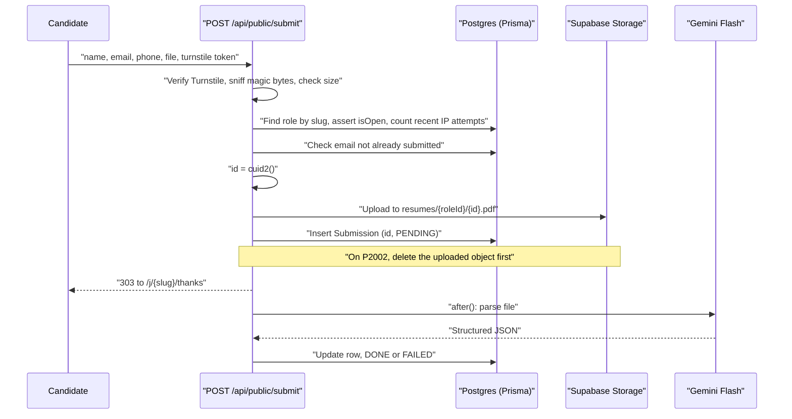

# DropResume - Build Plan

A hiring person creates a named link, shares it on LinkedIn, and every resume submitted
through it lands in one filterable, sortable list with AI-extracted fields.

Every decision below is locked. Nothing in this document is left for later negotiation.

---

## 1. Product scope (MVP)

### Recruiter side

- Sign up / sign in with Google or an email magic link.
- Create a **role** - a named bucket for one hiring intent. The title can be specific
  ("Senior Backend Engineer") or generic ("Hiring fullstack engineers"); the app treats
  both the same way and only maintains the resumes collected under it. "Role" is the
  word used in the UI, in the URLs, and in the database.
- Optional company name. When present, it is shown on the public form under the title.
- Optional role description field. When present, Gemini produces a 0-100 match score.
  When absent, no score is shown.
- Get a shareable public URL, e.g. `/j/hiring-fullstack-engineers-x7k2m9`.
- Close a role so it stops accepting submissions. Closing is a reversible pause and
  touches nothing else - the rows and the stored files stay exactly as they are.
- View the submission list: filter, sort, mark pending / shortlisted / rejected,
  open the original file, export to CSV.
- Delete a role, which also deletes its stored resume files.

### Candidate side

- Open the public URL, no account needed.
- Fill in name (required), email (required), phone (optional), attach a resume.
- Pass a Cloudflare Turnstile check, submit, see an instant confirmation.
- If that email already submitted to this role, the submission is rejected with a
  clear message.

### Explicitly out of scope for the MVP

- No email notifications of any kind (recruiter or candidate).
- No multi-stage pipeline (only pending / shortlisted / rejected).
- No custom per-role questions.
- No team accounts or shared access.
- No candidate login or submission history.
- No automatic re-score when a role description is edited.
- No time-based file expiry.

---

## 2. Stack

- **Framework:** Next.js `16.3.5` (App Router, TypeScript) - single app, UI and API
  together. Requires Node `>=20.9.0`.
- **Hosting:** Vercel.
- **UI:** Tailwind CSS v4 + shadcn/ui.
- **Database:** Supabase Postgres.
- **ORM:** Prisma `7.10.0`, pinned. The npm `latest` tag currently points at an
  `8.0.0` release candidate, which is not what an MVP should build on.
- **Package manager:** npm.
- **File storage:** Supabase Storage, private bucket, short-lived signed URLs.
- **Auth:** Supabase Auth - Google OAuth + email magic link.
- **AI:** Gemini Flash via `@google/genai` - parse + summary + optional match score.
- **Background work:** `after()` from `next/server`. It is the framework-level API and
  is backed by `waitUntil()` on Vercel.
- **Abuse protection:** Cloudflare Turnstile + per-IP rate limit counted in Postgres.

### Two consequences of choosing Prisma over the Supabase client

1. **Authorization lives in application code, not the database.** Supabase Row Level
   Security is bypassed because Prisma connects as the Postgres owner role. Every
   query that touches a role or submission must filter by the signed-in user's id.
   One `requireUser()` helper plus scoped query wrappers enforce this so it cannot be
   forgotten per route.
2. **Prisma needs two connection strings on serverless.** Supabase's transaction
   pooler for queries, and a direct connection for migrations:

```env
DATABASE_URL="postgresql://...@...pooler.supabase.com:6543/postgres?pgbouncer=true&connection_limit=1"
DIRECT_URL="postgresql://...@...supabase.com:5432/postgres"
```

`DIRECT_URL` goes in `datasource db { directUrl = env("DIRECT_URL") }`.

---

## 3. Data model (Prisma)

Supabase Auth owns `auth.users`. Our tables reference the Supabase user id as a
plain string; we do not manage passwords or sessions ourselves.

```prisma
model Role {
  id          String   @id @default(cuid())
  ownerId     String   // Supabase auth user id
  title       String
  companyName String?            // optional; shown on the public form
  slug        String   @unique   // "hiring-fullstack-engineers-x7k2m9"
  description String?            // optional; drives the match score
  isOpen      Boolean  @default(true)
  createdAt   DateTime @default(now())

  submissions Submission[]

  @@index([ownerId])
}

model Submission {
  id     String @id @default(cuid())   // always supplied explicitly by the app
  roleId String
  role   Role   @relation(fields: [roleId], references: [id], onDelete: Cascade)

  // what the candidate typed
  candidateName  String
  candidateEmail String
  candidatePhone String?

  // the stored file
  storagePath String   // path inside the private Supabase bucket
  fileName    String
  fileMime    String
  fileSize    Int

  // recruiter workflow
  status ReviewStatus @default(PENDING)

  // Gemini output
  parseStatus     ParseStatus @default(PENDING)
  parseError      String?
  rawText         String?     @db.Text
  aiSummary       String?
  matchScore      Int?        // null when the role has no description
  matchScoreReason String?    // one-line justification; shown as a tooltip on score
  parsedName      String?
  parsedEmail     String?
  parsedPhone     String?
  currentTitle    String?
  currentCompany  String?
  yearsExperience Float?
  highlySkilledAt String?    // "Backend", "Frontend", "Fullstack", "Data", etc.
  location        String?
  skills          String[]
  education       Json?

  createdAt DateTime @default(now())

  @@unique([roleId, candidateEmail])   // enforces duplicate rejection
  @@index([roleId, status])
}

model SubmitAttempt {
  id        String   @id @default(cuid())
  ipHash    String   // sha256(ip + APP_SALT), never the raw IP
  createdAt DateTime @default(now())

  @@index([ipHash, createdAt])
}

enum ReviewStatus { PENDING SHORTLISTED REJECTED }
enum ParseStatus  { PENDING DONE FAILED }
```

`Submission.id` keeps `@default(cuid())` as a safety net, but application code always
generates it with `cuid2` and passes it in, because the storage path needs the id
before the row exists.

The `@@unique([roleId, candidateEmail])` constraint is what makes duplicate rejection
correct even under two simultaneous submissions - we catch the Prisma unique-violation
error (`P2002`) rather than relying on a read-then-write check alone.

---

## 4. Routes

`/` **is** the dashboard. There is no marketing page and no `/dashboard` prefix.

### Pages

- `/` - the dashboard. Signed in: the user's roles with submission counts. Signed out:
  the same dashboard chrome with an empty state, a one-line pitch, and a "New role"
  button that links to `/login?next=/roles/new` so the intent survives sign-in.
- `/login` - Google button + magic link email input. Honours `?next=`.
- `/auth/callback` - route handler that exchanges the code for a cookie session, used
  by both providers.
- `/roles/new` - title, optional company name, optional description.
- `/roles/[id]` - the candidate table. Copy-link button, close toggle, CSV export,
  filters, sorting, row detail panel.
- `/j/[slug]` - public upload form. Renders a "no longer accepting submissions" state
  when `isOpen` is false.
- `/j/[slug]/thanks` - confirmation.

### API handlers

- `POST /api/roles` - create a role, generate the slug.
- `PATCH /api/roles/[id]` - rename, edit company name, edit description, open/close.
- `DELETE /api/roles/[id]` - delete the role, cascade submissions, delete the storage
  folder.
- `GET /api/roles/[id]/export` - CSV stream.
- `POST /api/public/submit` - multipart upload from the public form.
- `PATCH /api/submissions/[id]` - set review status.
- `POST /api/submissions/[id]/reparse` - retry a failed parse.
- `GET /api/submissions/[id]/file` - authorize the owner, mint a signed URL, redirect.

---

## 5. Submission flow



Two details that are easy to get wrong:

- **The id is generated in application code.** The storage path contains the submission
  id, and the upload happens before the insert, so the id cannot come from a database
  default.
- **A duplicate must not leak an orphan file.** There is a cheap existence check before
  the upload, and a `catch` on `P2002` that deletes the just-uploaded object before
  returning the duplicate error.

The candidate never waits on Gemini. The dashboard shows a "Processing" badge until
`parseStatus` becomes `DONE`, and the recruiter can open the original file immediately.

**Failure handling:** if the Gemini call throws or returns unparseable JSON, the row is
marked `FAILED` with the error message and the dashboard shows a "Retry parse" button.
The submission itself is never lost, because the file upload and the row insert both
happen before any AI call.

---

## 6. Gemini parsing

One call per resume. PDFs are sent to Gemini as inline file data. The prompt
asks for strict JSON matching a schema, using Gemini's structured-output mode so we are
not regex-parsing prose.

Requested fields: full name, email, phone, current title, current company, total years
of experience, primary strength (`highlySkilledAt`: Backend, Frontend, Fullstack, Data,
or similar), location, skills array, education array, a two-line summary, and - only
when the role has a description - a 0-100 match score with a one-line justification
stored as `matchScoreReason` for the score tooltip.

`rawText` is also stored so future features (keyword search, re-scoring against a new
description) never need a second paid call.

Cost sanity check: Gemini Flash on a two-page resume is a fraction of a cent, so a few
thousand submissions a month stays in the low single-digit dollars.

---

## 7. File handling

- Accepted: **PDF only.** DOC and DOCX are rejected with a message telling the
  candidate to export a PDF. Supporting `.docx` would mean a second text-extraction
  path for one file type, so there is exactly one parse path instead.
- Max size: 2 MB, enforced client-side for a fast error and server-side for real. This
  sits well under Vercel's 4.5 MB request body limit. Phone photos of a resume often
  exceed 2 MB, so the error copy should push people toward a PDF.
- Type checked by sniffing magic bytes, not by trusting the browser's mime string.
- Stored at `resumes/{roleId}/{submissionId}.{ext}` in a private bucket.
- Recruiters only ever receive signed URLs with a short expiry; the bucket is never
  public.
- **Retention: files are deleted when the role is deleted, and only then.** Closing a
  role stops new submissions and deletes nothing. There is no time-based expiry.

---

## 8. Dashboard table

Columns: name, title, current company, years of experience (YOE), skills, highly
skilled at, match score, status, submitted.

- **Score tooltip:** the one-line justification against the role description
  (`matchScoreReason`). The column header explains that the score is 0-100 vs that
  description, and is empty when the role has no description.
- **Submitted tooltip:** the full readable date and time; the cell itself stays
  relative ("2h ago").
- **Status:** while parsing, show Processing or Failed. Once parsed, show the review
  flag: Pending, Shortlisted, or Rejected.

- **Sort:** years of experience, match score, submitted date, name.
- **Filter:** status, minimum years, minimum score, skill contains, free-text search
  across name / title / company / raw text.
- **Bulk:** select rows, mark shortlisted or rejected.
- **Export:** CSV of the currently filtered and sorted view, not just everything.
- Filter state lives in the URL query string so a filtered view can be bookmarked.

The table's filter parsing and the CSV export share a single
`buildSubmissionWhere(searchParams)`, so the export cannot drift from the visible view.

Free-text search starts as Postgres `ILIKE` over name, title, company and `rawText`. A
trigram or tsvector index is a later optimisation, not MVP work.

Mobile gets a stacked card layout instead of a table.

---

## 9. Security and abuse

- Turnstile token verified server-side on every public submission.
- **Rate limiting is a Postgres count, not Redis.** Each public submission inserts a
  `SubmitAttempt` row keyed by `sha256(ip + APP_SALT)`; the raw IP is never stored. The
  limit is the number of rows for that hash in the last 10 minutes, and rows older than
  an hour are pruned opportunistically on the same request. No Upstash account.
- File type checked by sniffing content, not trusting the browser's mime string.
- Slugs carry a random suffix so links cannot be enumerated.
- Every recruiter query filtered by `ownerId` through `requireUser()` and the scoped
  query wrappers.
- Resume files only reachable via expiring signed URLs.
- Deleting a role removes both the rows and the stored files.

---

## 10. Environment variables

```env
NEXT_PUBLIC_SUPABASE_URL=
NEXT_PUBLIC_SUPABASE_ANON_KEY=
SUPABASE_SERVICE_ROLE_KEY=        # server-only, for storage writes
DATABASE_URL=                     # Supabase pooler, port 6543
DIRECT_URL=                       # Supabase direct, port 5432
GEMINI_API_KEY=
NEXT_PUBLIC_TURNSTILE_SITE_KEY=
TURNSTILE_SECRET_KEY=
APP_SALT=                         # salts the hashed IP used for rate limiting
NEXT_PUBLIC_APP_URL=
```

Local development runs without cloud credentials: Turnstile is bypassed when
`TURNSTILE_SECRET_KEY` is absent, and the parser returns fixed fields when
`GEMINI_API_KEY` is absent, so the app is runnable before any account is set up.

---

## 11. Build order

1. **Scaffold** - `create-next-app` with TypeScript and Tailwind, add shadcn/ui, commit
   a README explaining what DropResume is and how to run it.
2. **Database** - Supabase project, Prisma schema above, first migration, generated
   client.
3. **Auth** - Supabase Auth with Google and magic link, `/auth/callback`, session
   helpers, `requireUser()`, sign out.
4. **Roles CRUD** - create, list, rename, close, delete, slug generation, copy-link UI.
5. **Public form** - `/j/[slug]`, validation, closed state, duplicate-email rejection,
   upload to Storage, row insert, thanks page. Still no AI.
6. **Parsing** - Gemini behind a single `parseResume()` function, wired through
   `after()`, processing and failed states, retry button.
7. **Dashboard table** - columns, sorting, filtering, search, status flags, bulk
   actions, signed-URL file access.
8. **CSV export** - sharing `buildSubmissionWhere` with the table.
9. **Hardening** - Turnstile, Postgres rate limit, magic-byte sniffing, size limits,
   cascade delete of storage files.
10. **Polish and deploy** - empty / loading / error states, mobile layout, real copy,
    Vercel deploy with env vars.

Steps 1-5 are already a working product: a shareable link that collects resumes into a
list. Everything after that increases the value of the list.
